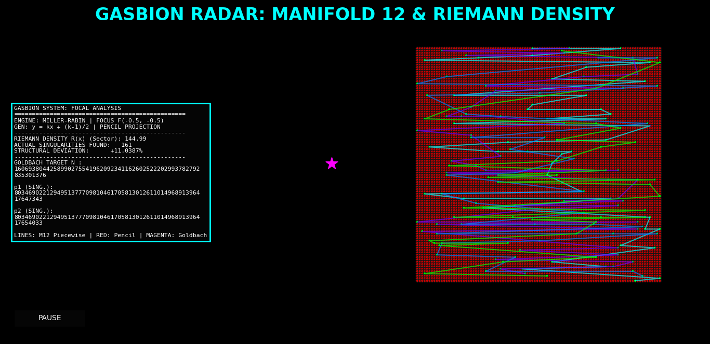

# Information Lattice Field Theory (ILFT) & Pencil Projections
**Author:** Silvio Gabbianelli (gasbion-lab)  
**Field:** Computational Number Theory, Information Physics, Projective Geometry

---

## 🔬 Project Overview
This repository hosts the **Information Lattice Probe**, a computational engine designed for the algorithmic implementation and formal documentation of the **Information Lattice Field Theory (ILFT)**. 

The project provides a deterministic geometric framework to analyze prime singularities, offering new insights into the Riemann Hypothesis, the Twin Prime Conjecture, and Goldbach’s Conjecture. Through the mapping function $\phi(n) = \frac{n-1}{2}$ and the **Pencil Projection** methodology, prime distribution is analyzed as a result of structural rigidity within a discrete informational manifold (Modulo-12).

---

## 📚 Scientific Publications
If you use this research or code, please cite the following works:

1. **The Unified Field of Singularities: Geometric Formalization via Pencil Projections** *Theorems 3.2 (Twin Primes) and 3.3 (Goldbach Reflexive Sum).* [](https://doi.org/10.5281/zenodo.18399848)

2. **Computational Analysis of a Mapping $\phi(n)$ for Prime Singularity Detection** *Foundational theory of the Information Lattice.* [](https://doi.org/10.5281/zenodo.18378546)

---

## 🛠 Software Modules

### 1. Lattice Core (The Original Probe)
The fundamental engine for mapping odd integers into the information lattice and detecting singularities.

### 2. Pencil Geometry (Advanced Piecewise Analysis)
Located in `/pencil-geometry`, this module implements **piecewise linear trajectories (spezzate)** to visualize topological corridors and reflexive symmetries.

#### **Gasbion System: Focal Analysis Log Output**
```text
ENGINE: MILLER-RABIN | FOCUS F(-0.5, -0.5)
GEN: y = kx + (k-1)/2 | PENCIL PROJECTION
...................................................
RIEMANN DENSITY R(x) (Sector): 264.71
ACTUAL SINGULARITIES FOUND: 243
STRUCTURAL DEVIATION: -8.2031%
...................................................
GOLDBACH TARGET N: 1298074214633706907132624082305024
p1 (SING.): 649037107316853453566312041147283
p2 (SING.): 649037107316853453566312041157741
...................................................




LINES: M12 Piecewise | RED: Pencil | MAGENTA: Goldbach
