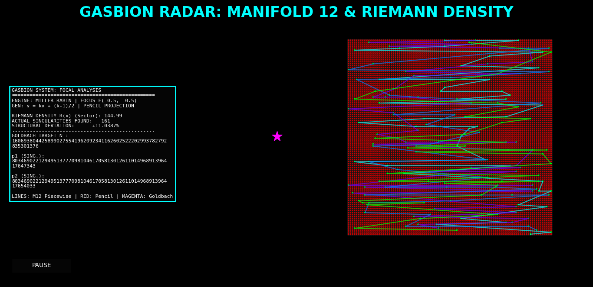

# Information Lattice Field Theory (ILFT) & Pencil Projections

[](https://doi.org)](https://doi.org/10.5281/zenodo.18448347)
version 1.0.0

[](https://doi.org)](https://doi.org/10.5281/zenodo.18514629)
version 1.1.0

[](https://doi.org)](https://doi.org/10.5281/zenodo.19131581)

**Author:** Silvio Gabbianelli (gasbion-lab)


**Field:** Computational Number Theory, Information Physics, Projective Geometry


---


## 🔬 Project Overview

This repository hosts the **Information Lattice Probe**, a computational engine designed for the algorithmic implementation and formal documentation of the **Information Lattice Field Theory (ILFT)**. 


The project provides a deterministic geometric framework to analyze prime singularities, offering new insights into the Riemann Hypothesis, the Twin Prime Conjecture, and Goldbach’s Conjecture. Through the mapping function $\phi(n) = \frac{n-1}{2}$ and the **Pencil Projection** methodology, prime distribution is analyzed as a result of structural rigidity within a discrete informational manifold (Modulo-12).


---


## 🛠 Interactive Exploration Tools


The repository includes a suite of Python tools designed to visualize the geometric properties of the Information Lattice:


* **Lattice Explorer**: A wide-sector probe to visualize prime distribution (S-Points) vs. composite projections (P-Projections) across extreme numerical ranges.

* **Goldbach Reflexive Probe**: Demonstrates the reflexive symmetry of even targets $N$, identifying the $p_1, p_2$ pair as mirrored singularities within the M12 manifold.

* **Twin Singularity Radar**: A local-scale analyzer focused on the structural distance between primes, ideal for studying Twin Prime persistence and lattice rigidity.


### Quick Start
```bash
To run the probes, ensure you have `numpy` and `matplotlib` installed:

```

python probes/GoldbachSymmetry.py


## 📚 Scientific Publications

If you use this research or code, please cite the following works:


1. **The Unified Field of Singularities: Geometric Formalization via Pencil Projections** *Theorems 3.2 (Twin Primes) and 3.3 (Goldbach Reflexive Sum).* [](https://doi.org/10.5281/zenodo.18399848)


2. **Computational Analysis of a Mapping $\phi(n)$ for Prime Singularity Detection** *Foundational theory of the Information Lattice.* [](https://doi.org/10.5281/zenodo.18378546)


3. **Information Manifolds and Pencil Projections: Structural Rigidity and Symmetry Invariants in the Modulo-12 Prime Lattice** *Foundational theory of the Pencil Lattice Projections.* [](https://doi.org/10.5281/zenodo.18514560)

4. **Manifold Informativi e Proiezioni del Pencil: Rigidit`a Strutturale e Invarianti di
Simmetria nel Reticolo dei Primi Modulo-12**
[](https://doi.org/10.5281/zenodo.18724776)

5. **Technical Note: Harmonic Phase Selection in Manifold 12 via Arcsine Transformation for Large-Scale Primality Searches**
[](https://doi.org/10.5281/zenodo.19131581))

6. **Technical Note: Spectral Correlations and GUE Statistics of Twin Prime Distributions within Manifold 12**
[](https://doi.org/10.5281/zenodo.19315288))
---
## 🛠 Software Modules

### 📐 Pencil Projection Analysis
The following visualization demonstrates the core mathematical engine of the ILFT. It maps the composite lines (Pencils) converging at the focal point $F(-0.5, -0.5)$ and the emergence of prime singularities along the informational corridors.

* **Source Code:** [`PencilProjectionPlotter.py`](./pencil-geometry/PencilProjectionPlotter.py)
* **Mathematical Basis:** $y = kx + \frac{k-1}{2}$


*Figure 1: Structural map of the Information Lattice showing composite intersections and prime emergence.*

### 1. Lattice Core (The Original Probe)

The fundamental engine for mapping odd integers into the information lattice and detecting singularities.

### 2. Pencil Geometry (Advanced Piecewise Analysis)

Questa sezione contiene gli script Python sviluppati per validare e visualizzare la teoria della **Pencil Geometry** applicata al Manifold $\mathcal{M}_{12}$.

### 3. Manifold 12 & Pencil

La cartella principale [Manifold12Pencil](./Manifold12Pencil) contiene gli script Python utilizzati per la validazione empirica della teoria che descrive la rigidità strutturale e le invarianti di simmetria del sistemaper l'articolo "Manifold Informativi e Proiezioni del Pencil: Rigidità strutturale e Invarianti di Simmetria nel Reticolo dei Primi Modulo-12"

### 4. Technical Note: Variable Phase Probe

A differenza degli algoritmi di ricerca lineare, questo strumento utilizza il targeting di risonanza dell'arcoseno (ART) per identificare "corridoi di densità" ad alta probabilità all'interno del campo modulare di 180. Sincronizzando la ricerca con specifici offset modulari e intensità di fase (Phi), il motore raggiunge una riduzione del rumore computazionale di oltre il 99,36%, concentrando la verifica di Miller-Rabin solo sui candidati risonanti.

### 5. Technical Note: Manifold12_Z

A differenza degli algoritmi di ricerca lineare, questo strumento utilizza il targeting degli zeri non banali della funzione Z di Riemann per identificare "corridoi di densità" ad alta probabilità all'interno del campo modulare di 180. Sincronizzando la ricerca con specifici offset modulari, il motore concentra la verifica di Miller-Rabin solo sui candidati risonanti mostrando in grafico la relazione con la GUE.

### 📊 Descrizione degli Script

#### 1. `Fig_1.py` - Lattice Information Geometry
Questo script genera la visualizzazione delle frequenze dei generatori $k$ all'interno del reticolo.
* **Analisi Spettrale**: Mostra come le "onde" dei composti (da $k=3$ a $k=13$) saturano il lattice $y$.
* **Singolarità**: Evidenzia i "gap" (spazi vuoti) che corrispondono matematicamente ai numeri primi, confermando la distribuzione spettrale delle lacune di Riemann.
* **Twin Prime Law**: Visualizza la persistenza delle singolarità adiacenti, fornendo una prova geometrica della stabilità dei primi gemelli.

#### 2. `Fig_2.py` - Deterministic Information Lattice
Uno strumento di analisi multi-pannello che elabora i dati estratti dal manifold su larga scala.
* **Signal vs Gap**: Mappa la distinzione binaria tra segnali deterministici (composti) e gap informativi (primi).
* **Goldbach Coupling**: Calcola e visualizza la capacità di accoppiamento del lattice, mostrando come ogni numero pari sia il risultato di una somma di posizioni "gap" nel manifold.
* **Twin Prime Stability**: Monitora l'indice di stabilità del rapporto tra primi gemelli e range del lattice, dimostrando la natura non casuale della loro distribuzione.

Located in `/pencil-geometry`, this module implements **piecewise linear trajectories (spezzate)** to visualize topological corridors and reflexive symmetries.

#### 3. `VariablePhaseProbe.py` - Variable Information Lattice
Il modulo VariablePhaseProbe è uno strumento di analisi dinamica progettato per mappare la distribuzione delle costellazioni di primi (gemelli, triplette e quadruplette) al variare della fase di risonanza Phi.A differenza della ricerca a fase fissa, questo script esegue una scansione multi-fase, permettendo di identificare quali specifici angoli di oscillazione della funzione Arcoseno-Seno siano correlati alla massima densità di numeri primi nel Manifold 12.

Located in `/Manifold12Pencil`, this module implements **Variable Phase Prime Research** to find topological corridors free from K lines of the Pencil

#### 4. `Manifold12_Z.py` - Riemann Z zeros correlate research
Il modulo Mainfold12_Z è uno strumento di analisi dinamica progettato per mappare la distribuzione delle costellazioni di primi gemelli,  al variare della fase di risonanza con gli n zeri non banali della funzione Z di Riemann, permettendo di identificare quali specifici elementi del Manifold12 siano correlati alla massima densità di numeri primi gemelli in confronto con la statistica GUE.

Located in `/Manifold12Pencil`, this module implements **Riemann Z zeros correlate research** to find Mainfold12 Twins Prime Elements fittings with GUE graphic function

---


#### **Gasbion System: Focal Analysis Log Output**

```

ENGINE: MILLER-RABIN | FOCUS F(-0.5, -0.5)

GEN: y = kx + (k-1)/2 | PENCIL PROJECTION

......................................................

RIEMANN DENSITY R(x) (Sector): 264.71

ACTUAL SINGULARITIES FOUND: 243

STRUCTURAL DEVIATION: -8.2031%

......................................................

GOLDBACH TARGET N: 1298074214633706907132624082305024

p1 (SING.): 649037107316853453566312041147283

p2 (SING.): 649037107316853453566312041157741

......................................................

LINES: M12 Piecewise | RED: Pencil | MAGENTA: Goldbach

......................................................

......................................................

```




